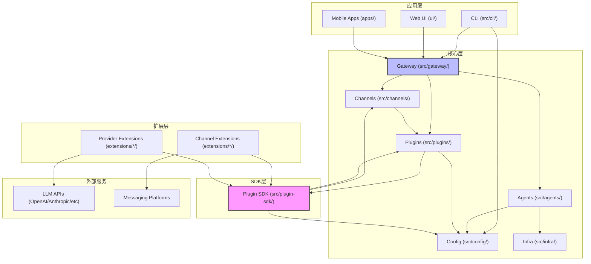

# OpenClaw 架构全景

## 项目概述

**它是什么**：OpenClaw 是一个支持 20+ 消息平台（WhatsApp、Telegram、Slack、Discord、iMessage 等）的个人 AI 助手网关，用户可在自有设备上运行。

**为什么存在**：它解决了跨平台 AI 助手部署的碎片化问题。没有 OpenClaw，开发者需要为每个消息平台单独集成 AI 能力，维护成本高且难以统一管理。OpenClaw 提供统一的抽象层，让 AI 能力一次开发，多平台复用。

**核心设计理念**：
1. **插件化架构** - 所有渠道和提供商都是插件，核心保持精简
2. **自托管优先** - 数据主权归用户所有，支持本地运行
3. **统一抽象** - 通过 ChannelPlugin 接口屏蔽平台差异
4. **渐进式扩展** - 从 CLI 到 Web UI 到移动端，层层递进

---

## 模块拆解

### src/ - 核心源码

**它是什么**：OpenClaw 的心脏，包含网关、CLI、配置管理、插件运行时等核心能力。

**为什么存在**：如果把这些逻辑塞进 extensions/，会导致核心与插件边界模糊，插件开发者需要理解过多内部细节。独立出来让插件 SDK 可以保持精简和稳定。

**主要文件**：
- `entry.ts` / `index.ts` - 程序入口，处理 CLI 启动、全局错误处理
- `library.ts` - 库模式导出，供外部程序调用
- `cli/` - 命令行界面实现，基于 Commander.js
- `gateway/` - WebSocket 网关服务，处理客户端连接、消息路由
- `config/` - 配置解析、验证、会话管理
- `channels/` - 渠道抽象层和内置渠道实现
- `agents/` - AI Agent 核心逻辑，包括提示词管理、工具调用
- `plugins/` - 插件注册、运行时管理、CLI 命令注册
- `plugin-sdk/` - 插件开发 SDK，导出给 extensions/ 使用
- `infra/` - 基础设施：日志、错误处理、HTTP 客户端、二进制管理
- `memory/` - 记忆/上下文管理
- `security/` - 安全策略、执行审批
- `routing/` - 会话路由、消息分发

---

### extensions/ - 插件扩展

**它是什么**：官方维护的渠道插件和提供商插件集合，每个子目录是一个独立 npm 包。

**为什么存在**：渠道集成需要依赖第三方库（如 `@whiskeysockets/baileys` for WhatsApp），且更新频率与核心不同。拆分到独立包后：
- 渠道可以独立版本发布
- 用户按需安装，减小核心体积
- 第三方开发者可以参考官方插件开发自己的集成

**主要插件**：
- `telegram/` - Telegram Bot API 集成
- `discord/` - Discord Bot 集成，支持语音
- `whatsapp/` - WhatsApp Web 集成（基于 Baileys）
- `slack/` - Slack Bot 集成
- `imessage/` - Apple iMessage 集成（macOS 专用）
- `line/` - LINE 消息平台
- `matrix/` - Matrix 协议支持
- `nostr/` - Nostr 去中心化社交协议
- `feishu/` - 飞书集成
- `googlechat/` - Google Chat 集成
- `msteams/` - Microsoft Teams 集成
- `openai/` / `anthropic/` / `google/` - LLM 提供商
- `memory-lancedb/` - 向量记忆存储

每个插件包含：
- `package.json` - 定义 `openclaw.extensions` 和 `openclaw.channel` 元数据
- `index.ts` - 插件入口，导出 `defineChannelPluginEntry` 或 `defineProviderPluginEntry`
- `src/` - 插件实现代码
- `setup-entry.ts` - 配置向导入口

---

### ui/ - 前端界面

**它是什么**：基于 Lit (Web Components) 的浏览器端控制面板。

**为什么存在**：提供一个图形化界面来配置和监控 OpenClaw，降低非技术用户使用门槛。与核心分离是因为：
- 前端技术栈（Lit + Vite）与后端（Node.js）完全不同
- 可以独立部署或嵌入到桌面应用中
- 支持热更新而不影响网关服务

**主要文件**：
- `src/main.ts` - 入口
- `src/ui/app.ts` - 主应用组件（600+ 行状态管理）
- `src/ui/views/` - 各页面视图（聊天、配置、渠道、定时任务等）
- `src/gateway.ts` - WebSocket 客户端，与后端网关通信

---

### apps/ - 移动端应用

**它是什么**：原生移动应用（Android、iOS、macOS）。

**为什么存在**：提供系统级集成（推送通知、分享扩展、小组件），这是 Web 应用无法做到的。与核心分离是因为：
- 需要原生开发工具链（Swift、Kotlin）
- 应用商店发布流程独立于 npm
- 平台特定能力（iMessage、推送、后台任务）

**主要目录**：
- `android/` - Android 应用（Kotlin + Gradle）
- `ios/` - iOS 应用（Swift + XcodeGen）
- `macos/` - macOS 应用（Swift）
- `shared/OpenClawKit/` - 共享 Swift 库（协议定义、网关通信）

---

### skills/ - 技能脚本

**它是什么**：可复用的 Agent 能力脚本，用 TypeScript/JavaScript 编写。

**为什么存在**：让用户无需修改核心代码即可扩展 AI 能力。技能可以：
- 定义工具函数供 Agent 调用
- 监听生命周期事件
- 访问插件 SDK 的部分能力

---

## 模块依赖关系



---

## 核心抽象

### 1. ChannelPlugin - 渠道插件接口

```typescript
// src/channels/plugins/types.plugin.ts
export type ChannelPlugin<ResolvedAccount = any, Probe = unknown, Audit = unknown> = {
  id: ChannelId;
  meta: ChannelMeta;
  capabilities: ChannelCapabilities;
  setup: ChannelSetupAdapter;
  config: ChannelConfigAdapter<ResolvedAccount>;
  security?: ChannelSecurityAdapter<ResolvedAccount>;
  outbound?: ChannelOutboundAdapter;
  // ... 更多可选适配器
};
```

这是整个系统最重要的抽象。所有消息平台（Telegram、Discord、WhatsApp 等）都通过实现这个接口接入系统。

### 2. PluginRuntime - 插件运行时

```typescript
// src/plugins/runtime/types.ts
export type PluginRuntime = {
  agent: AgentRuntimeApi;
  channel: ChannelRuntimeApi;
  config: ConfigRuntimeApi;
  conversation: ConversationRuntimeApi;
  // ... 更多运行时 API
};
```

插件通过运行时 API 与核心交互，而非直接导入核心模块。这保证了插件的向后兼容性。

### 3. GatewayRequest/GatewayResponse - 网关协议

WebSocket 通信协议，定义客户端（UI/CLI）与网关的交互方式：
- 聊天请求/响应
- 配置读写
- 渠道状态查询
- 执行审批流程

### 4. OpenClawConfig - 配置模型

统一的配置树，包含：
- 渠道账号配置
- Agent 身份和提示词
- 路由规则
- 安全策略

### 5. SessionKey - 会话路由标识

```typescript
// 格式: <agentId>:<channel>:<accountId>:<peerId>
// 示例: "default:telegram:mybot:user123"
```

用于唯一标识对话会话，支持跨渠道的状态保持。

---

## 扩展机制

**它是什么**：OpenClaw 提供三层扩展能力：

1. **渠道插件（Channel Plugin）** - 接入新消息平台
   - 实现 `ChannelPlugin` 接口
   - 通过 `defineChannelPluginEntry` 注册
   - 示例：`extensions/telegram/`, `extensions/discord/`

2. **提供商插件（Provider Plugin）** - 接入新 LLM/服务
   - 实现流式聊天、嵌入、语音等能力
   - 通过 `defineProviderPluginEntry` 注册
   - 示例：`extensions/openai/`, `extensions/anthropic/`

3. **技能脚本（Skills）** - 扩展 Agent 能力
   - 放在 `skills/` 目录的 TypeScript 文件
   - 导出工具函数和生命周期钩子
   - 无需编译，热加载

**为什么这么设计**：

1. **分层扩展**：不同复杂度需求对应不同扩展方式。简单工具用 Skills，深度集成用 Channel/Provider 插件。

2. **运行时隔离**：插件通过 `PluginRuntime` API 与核心交互，而非直接依赖核心模块。这允许：
   - 核心升级而不破坏插件
   - 插件错误不影响核心稳定
   - 插件可以独立发布到 npm

3. **配置驱动**：所有扩展都通过统一的配置系统管理，用户无需编写代码即可启用/配置扩展。

4. **渐进式披露**：初学者从 Skills 开始，进阶开发者开发 Provider，专业贡献者开发 Channel，每层都有完整的类型支持和文档。

---

## 架构总结

OpenClaw 采用**洋葱架构**设计：

- **最内层**：核心类型和接口（`src/channels/plugins/types*.ts`）
- **中间层**：网关、配置、插件运行时（`src/gateway/`, `src/config/`, `src/plugins/`）
- **外层**：具体渠道实现（`extensions/*/`）
- **最外层**：UI 和移动应用（`ui/`, `apps/`）

这种设计的优势：
1. **可测试性**：每层可以独立单元测试
2. **可替换性**：渠道实现可以替换而不影响核心
3. **可扩展性**：新平台通过标准接口接入
4. **可维护性**：边界清晰，代码所有权明确
