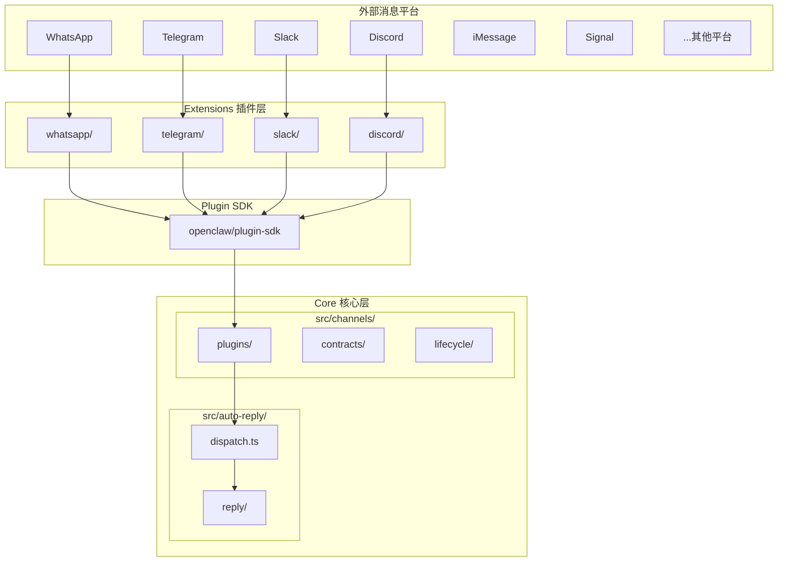
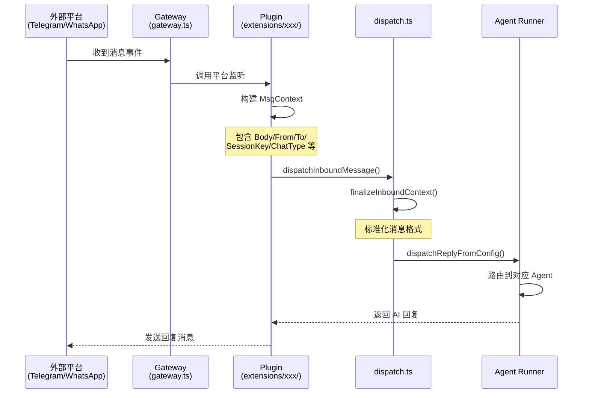
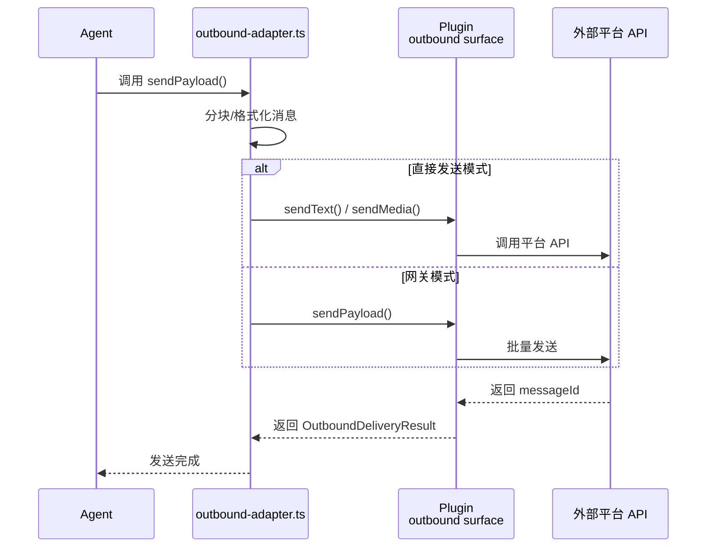
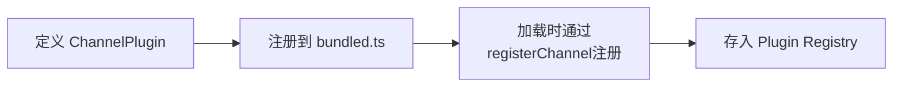

# 核心机制：Channels 系统

## 这是什么机制

**它是什么**：Channels 系统是 OpenClaw 的**统一消息渠道抽象层**，负责将 WhatsApp、Telegram、Slack、Discord 等 20+ 外部消息平台接入 OpenClaw 核心，使 AI Agent 能够以统一的方式收发消息。

**为什么需要它**：没有 Channels 机制，OpenClaw 需要为每个消息平台编写硬编码的集成逻辑，导致：
- 每新增一个平台需要修改核心代码
- 各平台差异（认证方式、消息格式、API 限制）直接侵入业务逻辑
- 无法支持用户自定义渠道扩展

**设计核心**：采用**"核心抽象 + 插件实现"**的分层架构，核心定义统一的消息契约（Inbound/Outbound/生命周期），具体平台实现以插件形式注册，保持核心与渠道实现的解耦。

---

## 架构概览



---

## 核心组件

### 1. 渠道插件契约 (`src/channels/plugins/`)

**ChannelPlugin 接口** (`types.plugin.ts:55-94`) 定义了渠道必须实现的能力：

| 能力域 | 说明 | 关键接口 |
|--------|------|----------|
| `config` | 账号配置管理 | `ChannelConfigAdapter` |
| `setup` | 初始化/设置向导 | `ChannelSetupAdapter` |
| `gateway` | 连接生命周期管理 | `ChannelGatewayAdapter` |
| `outbound` | 消息发送 | `ChannelOutboundAdapter` |
| `status` | 状态监控 | `ChannelStatusAdapter` |
| `security` | 安全策略（DM/群组） | `ChannelSecurityAdapter` |
| `threading` | 线程/话题管理 | `ChannelThreadingAdapter` |
| `messaging` | 消息动作（发送/反应/投票） | `ChannelMessageActionAdapter` |
| `directory` | 联系人/群组目录 | `ChannelDirectoryAdapter` |

### 2. 内置渠道插件 (`src/channels/plugins/bundled.ts:22-36`)

```typescript
export const bundledChannelPlugins = [
  bluebubblesPlugin,   // iMessage
  discordPlugin,       // Discord
  feishuPlugin,        // 飞书
  imessagePlugin,      // iMessage (macOS)
  ircPlugin,           // IRC
  linePlugin,          // LINE
  mattermostPlugin,    // Mattermost
  nextcloudTalkPlugin, // Nextcloud Talk
  signalPlugin,        // Signal
  slackPlugin,         // Slack
  synologyChatPlugin,  // Synology Chat
  telegramPlugin,      // Telegram
  zaloPlugin,          // Zalo
] as ChannelPlugin[];
```

### 3. 扩展渠道插件 (`extensions/`)

每个扩展渠道是一个独立的 npm workspace，例如：

**Telegram 扩展** (`extensions/telegram/src/channel.ts:311-782`)
- 实现 `ChannelPlugin` 接口
- 使用 `createChatChannelPlugin()` 工厂函数创建
- 包含平台特定的消息处理、Bot API 集成

**WhatsApp 扩展** (`extensions/whatsapp/src/channel.ts:60-331`)
- Web 版 WhatsApp 集成
- QR 码登录流程
- 支持群组和私信

**Slack 扩展** (`extensions/slack/src/channel.ts:282-614`)
- Socket Mode / HTTP Webhook 双模式
- Block Kit 富消息支持

---

## 消息流

### 入站消息流 (Inbound)



**关键调用链**：

```
外部平台 Webhook/Socket
  → extensions/telegram/src/bot-handlers.ts (消息处理器)
    → extensions/telegram/src/bot-message-context.ts (构建上下文)
      → src/auto-reply/dispatch.ts:35 (dispatchInboundMessage)
        → src/auto-reply/reply/inbound-context.ts:37 (finalizeInboundContext)
          → src/auto-reply/reply/dispatch-from-config.ts (路由分发)
```

### 出站消息流 (Outbound)



**关键调用链**：

```
Agent 生成回复
  → src/channels/plugins/outbound/direct-text-media.ts:130 (createDirectTextMediaOutbound)
    → extensions/xxx/src/outbound-adapter.ts (平台适配)
      → extensions/xxx/src/send.ts (实际发送)
        → 平台 API (Telegram Bot API / WhatsApp Web / Slack API)
```

---

## 渠道生命周期

### 1. 注册阶段 (Registration)



**代码位置**：`src/channels/plugins/bundled.ts:48-71`

### 2. 初始化阶段 (Setup)

```typescript
// ChannelSetupAdapter 接口 (types.adapters.ts:56-89)
type ChannelSetupAdapter = {
  resolveAccountId?: (params) => string;
  applyAccountConfig: (params) => OpenClawConfig;
  validateInput?: (params) => string | null;
  afterAccountConfigWritten?: (params) => Promise<void>;
};
```

**流程**：
1. 用户运行 `openclaw channel add telegram`
2. 调用 `setup.validateInput()` 验证输入
3. 调用 `setup.applyAccountConfig()` 写入配置
4. 调用 `setup.afterAccountConfigWritten()` 完成初始化

### 3. 连接阶段 (Gateway)

```typescript
// ChannelGatewayAdapter 接口 (types.adapters.ts:346-360)
type ChannelGatewayAdapter = {
  startAccount?: (ctx) => Promise<unknown>;  // 启动连接
  stopAccount?: (ctx) => Promise<void>;      // 停止连接
  loginWithQrStart?: (params) => Promise<...>; // QR 登录开始
  loginWithQrWait?: (params) => Promise<...>;  // QR 登录等待
  logoutAccount?: (ctx) => Promise<...>;     // 登出
};
```

**状态流转**：

```
未配置 → 已配置 → 连接中 → 已连接
            ↓         ↓
         断开连接 ← 错误
```

### 4. 运行时阶段 (Runtime)

- **入站监听**：各平台通过 Webhook、WebSocket 或轮询接收消息
- **心跳检测**：`ChannelHeartbeatAdapter.checkReady()` 检查健康状态
- **状态上报**：`ChannelStatusAdapter.buildAccountSnapshot()` 定期上报状态

---

## 关键设计决策

### 1. 为什么核心与扩展分离？

**设计原则**：`src/channels/` 只保留**契约和通用逻辑**，平台特定实现放在 `extensions/`

**好处**：
- 核心包体积控制（不必依赖所有平台的 SDK）
- 支持按需安装渠道插件
- 第三方可独立开发渠道插件

**边界划分**：

| 层级 | 职责 | 示例 |
|------|------|------|
| `src/channels/plugins/` | 契约定义、通用适配器、插件加载 | `types.plugin.ts`, `load.ts` |
| `src/plugin-sdk/` | 渠道开发 SDK、辅助函数 | `core.ts`, `outbound-runtime.ts` |
| `extensions/xxx/` | 平台特定实现 | Telegram Bot API 调用 |

### 2. 如何强制渠道无关边界？

**契约测试** (`src/channels/plugins/contracts/`):

```typescript
// inbound.contract.test.ts:110-153
it("keeps Discord inbound context finalized", () => {
  const ctx = finalizeInboundContext({...});
  expectChannelInboundContextContract(ctx); // 验证契约
});

// outbound-payload.contract.test.ts:238-286
installChannelOutboundPayloadContractSuite({
  channel: "slack",
  chunking: { mode: "passthrough", longTextLength: 5000 },
});
```

**强制要求**：
- 所有渠道必须通过 `ChannelPlugin` 接口注册
- 入站消息必须通过 `finalizeInboundContext()` 标准化
- 出站消息必须通过 `OutboundDeliveryResult` 格式返回

### 3. 消息上下文标准化

**MsgContext** (`src/auto-reply/templating.ts`) 定义统一的消息字段：

```typescript
type MsgContext = {
  Body: string;              // 消息正文
  BodyForAgent: string;      // 给 AI 的正文（已清洗）
  From: string;              // 发送者标识
  To: string;                // 接收者标识
  SessionKey: string;        // 会话唯一键
  ChatType: "direct" | "group" | "channel";
  ConversationLabel: string; // 会话显示名称
  SenderName: string;        // 发送者名称
  Provider: string;          // 渠道标识
  // ... 媒体、引用、命令等相关字段
};
```

**标准化流程** (`src/auto-reply/reply/inbound-context.ts:37-128`)：
1. 清洗系统标签和换行符
2. 解析并标准化 ChatType
3. 生成 ConversationLabel（回退逻辑）
4. 对齐媒体类型和路径
5. 设置默认授权状态

---

## 新增渠道的步骤

基于现有模式，新增一个渠道需要：

1. **创建扩展目录** `extensions/newchannel/`
2. **实现 ChannelPlugin 接口**：
   - `config`: 账号配置解析
   - `setup`: 初始化向导
   - `gateway`: 连接管理（start/stop）
   - `outbound`: 消息发送适配
   - `status`: 状态探针
3. **入站消息处理**：
   - 监听平台事件
   - 构建 `MsgContext`
   - 调用 `dispatchInboundMessage()`
4. **注册到 bundled.ts**（如果是内置渠道）

**参考实现**：
- 简单渠道：参考 `extensions/irc/src/channel.ts`
- 复杂渠道：参考 `extensions/telegram/src/channel.ts` 或 `extensions/slack/src/channel.ts`

---

## 总结

Channels 系统是 OpenClaw 的**消息基础设施层**，通过以下设计实现多平台统一接入：

1. **契约驱动**：`ChannelPlugin` 接口定义清晰的扩展点
2. **分层架构**：核心契约 → SDK 辅助 → 插件实现
3. **标准化流程**：入站/出站消息经过统一格式转换
4. **生命周期管理**：完整的注册→设置→连接→运行→断开流程
5. **质量保障**：契约测试确保各渠道行为一致
