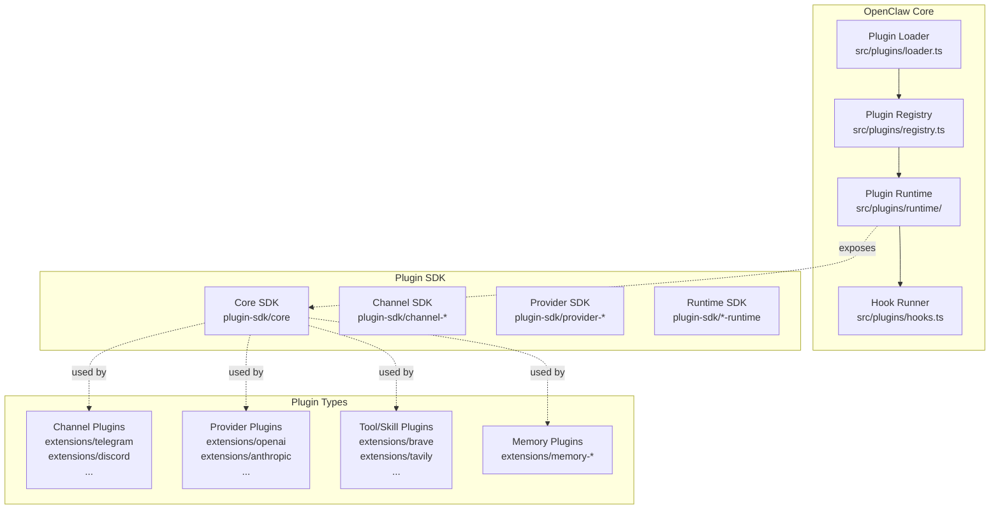
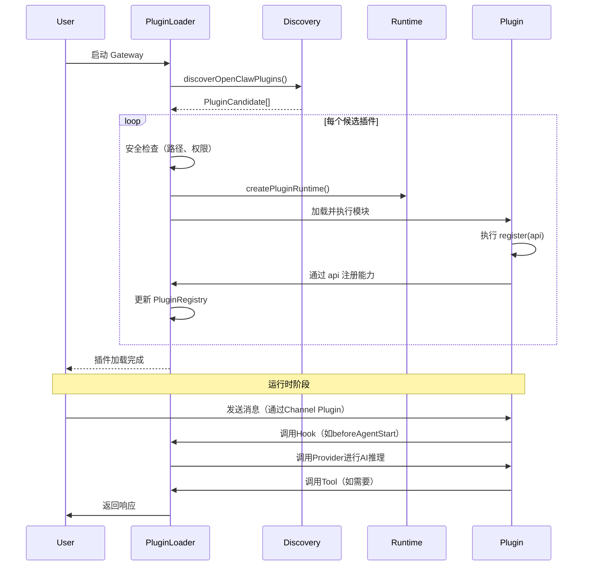

# 核心机制：OpenClaw 插件系统 (Plugin System)

## 这是什么机制

**它是什么**：OpenClaw插件系统是一个**模块化扩展架构**，允许第三方开发者通过标准化SDK为OpenClaw AI网关添加新功能（如消息渠道、AI模型提供商、工具技能等），而无需修改核心代码。

**为什么需要它**：没有插件机制，OpenClaw将是一个单体应用，所有功能（85+个消息渠道、50+个AI提供商、各种工具）都必须内置于核心代码库中。这会导致：
- 核心代码膨胀，维护困难
- 新功能发布依赖核心版本迭代
- 用户被迫安装不需要的功能
- 第三方无法贡献扩展

**设计核心**：采用**"内核+扩展"架构**，核心只保留通用能力，所有具体实现（渠道、提供商、工具）都通过插件形式动态加载。插件之间通过统一的运行时API和注册机制与核心交互。

---

## 架构概览



---

## 调用链

```
用户启动 Gateway
  → src/plugins/loader.ts:loadOpenClawPlugins()
    → discoverOpenClawPlugins() 扫描插件目录
      → 从 extensions/ 目录发现插件候选
    → 为每个插件创建 PluginRuntime
      → src/plugins/runtime/index.ts:createPluginRuntime()
    → 执行插件注册函数 register(api)
      → 插件调用 api.registerChannel() / api.registerProvider() 等
    → 将注册信息存入 PluginRegistry
      → src/plugins/registry.ts:createPluginRegistry()
  → 核心通过 Registry 使用插件能力
    → 消息路由 → Channel Plugin
    → AI 调用 → Provider Plugin
    → 工具执行 → Tool Plugin
```

---

## 核心组件详解

### 1. 插件发现 (Discovery)

**文件**: `/Users/zhihu/code/m_code/ai/openclaw-my/src/plugins/discovery.ts`

插件发现系统负责从多个来源扫描和识别插件：

| 来源 | 优先级 | 说明 |
|------|--------|------|
| `config` | 最高 | 用户通过 `plugins.load.paths` 显式指定的路径 |
| `workspace` | 高 | 当前工作区的 `.openclaw/extensions/` 目录 |
| `bundled` | 中 | 与OpenClaw一起打包的 `extensions/` 目录 |
| `global` | 低 | 用户主目录的 `.config/openclaw/extensions/` |

**安全机制**：
- 路径边界检查（防止目录遍历攻击）
- 文件权限检查（拒绝 world-writable 路径）
- 所有权验证（非捆绑插件需匹配当前用户）

### 2. 插件清单 (Manifest)

**文件**: `/Users/zhihu/code/m_code/ai/openclaw-my/src/plugins/manifest.ts`

每个插件通过 `openclaw.plugin.json` 声明其元数据：

```typescript
type PluginManifest = {
  id: string;                    // 唯一标识符
  configSchema: Record<string, unknown>;  // 配置项JSON Schema
  kind?: "memory" | "context-engine";     // 插件类型
  channels?: string[];           // 提供的渠道ID
  providers?: string[];          // 提供的AI提供商ID
  skills?: string[];             // 提供的技能ID
  providerAuthEnvVars?: Record<string, string[]>;  // 认证环境变量
};
```

### 3. 插件注册表 (Registry)

**文件**: `/Users/zhihu/code/m_code/ai/openclaw-my/src/plugins/registry.ts`

注册表是插件系统的核心数据结构，存储所有已注册的能力：

```typescript
type PluginRegistry = {
  plugins: PluginRecord[];           // 插件元数据
  tools: PluginToolRegistration[];   // 注册的工具
  hooks: PluginHookRegistration[];   // 生命周期钩子
  channels: PluginChannelRegistration[];     // 消息渠道
  providers: PluginProviderRegistration[];   // AI提供商
  speechProviders: PluginSpeechProviderRegistration[];
  imageGenerationProviders: PluginImageGenerationProviderRegistration[];
  webSearchProviders: PluginWebSearchProviderRegistration[];
  httpRoutes: PluginHttpRouteRegistration[]; // HTTP路由
  cliRegistrars: PluginCliRegistration[];    // CLI命令
  services: PluginServiceRegistration[];     // 后台服务
};
```

### 4. 插件运行时 (Runtime)

**文件**: `/Users/zhihu/code/m_code/ai/openclaw-my/src/plugins/runtime/index.ts`

每个插件在加载时获得一个 `PluginRuntime` 对象，提供以下能力：

```typescript
type PluginRuntime = {
  version: string;           // OpenClaw版本
  config: {...};            // 配置读写
  agent: {...};             // Agent操作
  subagent: {...};          // 子Agent管理
  system: {...};            // 系统信息
  media: {...};             // 媒体处理
  tools: {...};             // 工具注册
  channel: {...};           // 渠道操作
  events: {...};            // 事件系统
  logging: {...};           // 日志记录
  state: {...};             // 状态存储
  imageGeneration: {...};   // 图像生成
  webSearch: {...};         // 网络搜索
  tts: {...};               // 语音合成
  stt: {...};               // 语音识别
  mediaUnderstanding: {...}; // 媒体理解
  modelAuth: {...};         // 模型认证
};
```

---

## 插件类型详解

### 1. 渠道插件 (Channel Plugins)

**职责**：连接外部消息平台（Telegram、Discord、Slack等）

**示例**：`/Users/zhihu/code/m_code/ai/openclaw-my/extensions/telegram/index.ts`

```typescript
import { defineChannelPluginEntry } from "openclaw/plugin-sdk/core";

export default defineChannelPluginEntry({
  id: "telegram",
  name: "Telegram",
  description: "Telegram channel plugin",
  plugin: telegramPlugin,
  setRuntime: setTelegramRuntime,
});
```

**关键特性**：
- 每个渠道插件实现 `ChannelPlugin` 接口
- 包含消息接收、发送、线程管理、安全策略等能力
- 通过 `setupEntry` 支持启动时配置向导

### 2. 提供商插件 (Provider Plugins)

**职责**：集成AI模型提供商（OpenAI、Anthropic、Google等）

**示例**：`/Users/zhihu/code/m_code/ai/openclaw-my/extensions/openai/index.ts`

```typescript
import { definePluginEntry } from "openclaw/plugin-sdk/plugin-entry";

export default definePluginEntry({
  id: "openai",
  name: "OpenAI Provider",
  description: "Bundled OpenAI provider plugins",
  register(api) {
    api.registerProvider(buildOpenAIProvider());
    api.registerSpeechProvider(buildOpenAISpeechProvider());
    api.registerImageGenerationProvider(buildOpenAIImageGenerationProvider());
  },
});
```

**关键特性**：
- 支持文本推理、语音、图像生成、媒体理解等多种提供商类型
- 提供认证流程（API Key、OAuth、Device Code等）
- 支持动态模型发现和运行时模型解析

### 3. 工具/技能插件 (Tool/Skill Plugins)

**职责**：为Agent提供额外能力（搜索、计算、文件操作等）

**示例**：Web搜索提供商

```typescript
type WebSearchProviderPlugin = {
  id: string;
  label: string;
  createTool: (ctx: WebSearchProviderContext) => WebSearchProviderToolDefinition;
};
```

---

## 插件生命周期



---

## Plugin SDK 架构

### 为什么有50+个子路径导出？

OpenClaw的Plugin SDK采用**细粒度子路径导出**设计（`package.json` 中定义了50+个 `plugin-sdk/*` 导出），原因如下：

1. **按需加载**：插件只导入需要的功能，减少启动时间和内存占用
2. **类型安全**：每个子路径有独立的类型定义，避免循环依赖
3. **边界清晰**：渠道插件、提供商插件、工具插件使用不同的SDK子集
4. **版本兼容**：子路径可以独立演进，不影响其他插件

**主要SDK子路径分类**：

| 类别 | 子路径示例 | 用途 |
|------|-----------|------|
| 核心 | `plugin-sdk/core` | 插件定义、注册API |
| 渠道 | `plugin-sdk/channel-*` | 渠道插件专用 |
| 提供商 | `plugin-sdk/provider-*` | 提供商插件专用 |
| 运行时 | `plugin-sdk/*-runtime` | 运行时能力访问 |
| 特定渠道 | `plugin-sdk/telegram`, `plugin-sdk/discord` | 特定渠道工具 |

### 插件边界强制执行

**文件**: `/Users/zhihu/code/m_code/ai/openclaw-my/src/plugins/runtime/runtime-plugin-boundary.ts`

OpenClaw通过以下机制确保插件边界：

1. **导入限制**（Lint规则）：
   - `lint:extensions:no-src-outside-plugin-sdk`：扩展不能导入 `src/` 目录
   - `lint:plugins:no-extension-imports`：插件间不能直接导入
   - `lint:plugins:no-monolithic-plugin-sdk-entry-imports`：禁止从 `plugin-sdk` 整体导入

2. **运行时隔离**：
   - 每个插件获得独立的 `PluginRuntime` 实例
   - 通过 `withPluginRuntimePluginIdScope` 追踪插件上下文
   - 文件系统访问限制在插件根目录内

3. **边界文件读取**：
   - `src/infra/boundary-file-read.ts` 提供安全的文件读取
   - 防止路径遍历攻击
   - 拒绝硬链接和符号链接逃逸

---

## 安全考虑

### 1. 代码执行安全

- 插件通过 **Jiti** 动态加载（支持TypeScript无需预编译）
- 插件代码在Node.js进程中运行（与核心相同进程）
- 沙箱化通过**模块边界**而非进程隔离实现

### 2. 文件系统安全

- 插件只能访问其根目录内的文件
- 通过 `openBoundaryFileSync` 进行安全文件操作
- 拒绝 world-writable 路径的插件加载

### 3. 网络安全

- 插件通过 `PluginRuntime` 提供的封装方法进行网络请求
- SSRF（服务器端请求伪造）防护通过 `ssrf-runtime` SDK实现
- 请求URL白名单机制

### 4. 认证安全

- 插件不直接处理敏感凭证
- 通过 `modelAuth` 运行时接口安全获取API Key
- 支持多种凭证存储方式（环境变量、配置文件、密钥管理服务）

---

## 关键设计决策

### 1. 为什么使用Jiti而不是预编译？

**决策**：插件使用Jiti在运行时直接加载TypeScript文件，而非要求预编译为JavaScript。

**理由**：
- 简化插件开发流程，无需构建步骤
- 支持类型安全的动态加载
- 与Node.js生态更好的兼容性

**权衡**：
- 启动时有编译开销（通过缓存缓解）
- 运行时性能略低于预编译代码

### 2. 为什么注册表是中心化的？

**决策**：所有插件能力注册到单一的 `PluginRegistry` 对象。

**理由**：
- 便于核心统一管理和协调插件
- 支持钩子的优先级排序和结果合并
- 简化调试和监控

**权衡**：
- 注册表成为潜在的瓶颈（通过缓存和惰性加载缓解）

### 3. 为什么Provider Plugin如此复杂？

**决策**：Provider Plugin接口包含20+个可选钩子（认证、模型解析、流包装等）。

**理由**：
- AI提供商生态高度异构
- 需要支持从简单API Key到复杂OAuth的各种认证方式
- 允许提供商自定义模型发现、使用统计、缓存策略等

**设计原则**：**"80%默认，20%定制"** - 简单提供商只需实现基础接口，复杂提供商可以深度定制。

---

## 如何创建新插件

### 渠道插件示例

```typescript
// my-channel/index.ts
import { defineChannelPluginEntry, createChatChannelPluginBase } from "openclaw/plugin-sdk/core";

const myChannelPlugin = createChatChannelPluginBase({
  id: "my-channel",
  setup: async (cfg, account) => {
    // 初始化连接
    return { client, accountId: account.accountId };
  },
  capabilities: {
    send: async (ctx, message) => {
      // 发送消息实现
    },
    // ...其他能力
  },
});

export default defineChannelPluginEntry({
  id: "my-channel",
  name: "My Channel",
  description: "A custom messaging channel",
  plugin: myChannelPlugin,
});
```

### 提供商插件示例

```typescript
// my-provider/index.ts
import { definePluginEntry } from "openclaw/plugin-sdk/plugin-entry";

export default definePluginEntry({
  id: "my-provider",
  name: "My AI Provider",
  description: "Custom AI model provider",
  register(api) {
    api.registerProvider({
      id: "my-provider",
      label: "My Provider",
      auth: [{
        id: "api-key",
        label: "API Key",
        kind: "api_key",
        run: async (ctx) => {
          // 认证流程
        },
      }],
      // ...其他配置
    });
  },
});
```

---

## 总结

OpenClaw插件系统是一个**成熟、安全、可扩展**的架构，其核心设计原则包括：

1. **模块化**：核心与扩展完全分离，通过标准接口交互
2. **安全优先**：多层边界检查防止恶意插件逃逸
3. **类型安全**：全面的TypeScript支持，50+个SDK子路径
4. **生态友好**：支持从简单到复杂的各种插件需求
5. **性能优化**：缓存、惰性加载、并行执行

这套架构使OpenClaw能够支持85+个消息渠道和50+个AI提供商，同时保持核心代码的简洁和可维护性。
