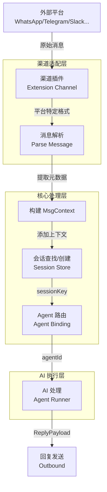
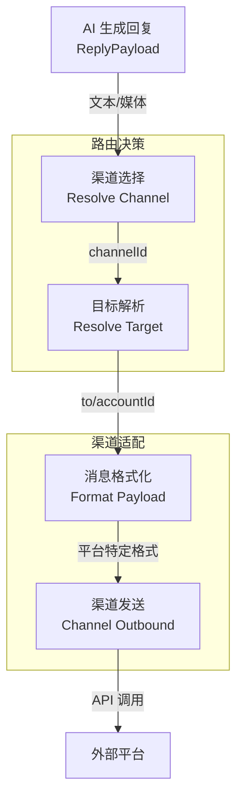
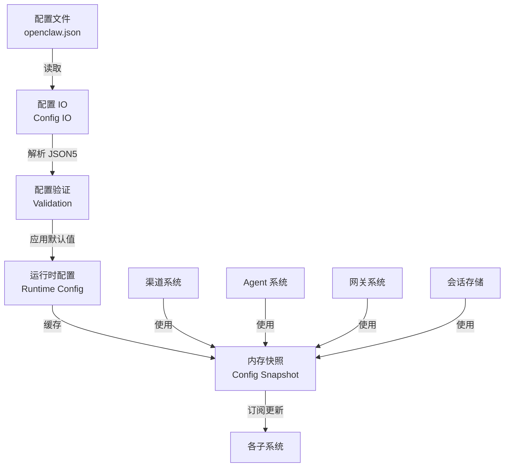

# 数据流与状态管理

## 核心数据结构

### 1. MsgContext - 消息上下文

**它是什么**：MsgContext 是 OpenClaw 中贯穿整个消息处理流程的核心数据结构，承载了从外部平台接收到的消息的所有元数据和内容。

**为什么这样建模**：
- 统一格式：20+ 不同平台的消息格式各异，MsgContext 提供统一抽象
- 上下文传递：从消息接收到 AI 处理再到回复发送，一个对象传递全部信息
- 模板支持：支持动态模板插值（如 `{{SenderName}}`）

**关键字段说明**：

```typescript
// 消息内容相关
Body?: string;                    // 消息正文
BodyForAgent?: string;            // 发送给 AI 的提示词（可能包含历史/上下文）
RawBody?: string;                 // 原始消息体（无结构上下文）
CommandBody?: string;             // 用于命令检测的消息体
InboundHistory?: Array<{...}>;    // 最近聊天历史

// 身份标识相关
From?: string;                    // 发送者 ID
To?: string;                      // 接收者 ID
SessionKey?: string;              // 会话唯一标识
SenderName?: string;              // 发送者显示名称
SenderId?: string;                // 发送者平台 ID
SenderUsername?: string;          // 发送者用户名

// 平台/渠道相关
Provider?: string;                // 提供商（如 whatsapp, telegram）
Surface?: string;                 // 平台表面（如 discord, slack）
ChannelId?: string;               // 渠道 ID
AccountId?: string;               // 多账号场景下的账号 ID

// 消息关系相关
MessageSid?: string;              // 消息唯一 ID
ReplyToId?: string;               // 回复的目标消息 ID
RootMessageId?: string;           // 线程根消息 ID（用于飞书等平台的 thread）
ForwardedFrom?: string;           // 转发来源

// 媒体相关
MediaPath?: string;               // 本地媒体文件路径
MediaUrl?: string;                // 媒体 URL
MediaType?: string;               // 媒体类型
Sticker?: StickerMetadata;        // Telegram 贴纸元数据

// 路由相关
OriginatingChannel?: OriginatingChannelType;  // 回复路由目标渠道
OriginatingTo?: string;           // 回复目标地址
ExplicitDeliverRoute?: boolean;   // 是否显式请求外部投递

// 安全和权限
CommandAuthorized?: boolean;      // 命令是否已授权
OwnerAllowFrom?: Array<string>;   // 所有者显式允许列表
```

### 2. SessionEntry - 会话条目

**它是什么**：SessionEntry 是会话存储（sessions.json）中的单条记录，持久化保存了每个会话的状态和元数据。

**为什么这样建模**：
- 状态持久化：会话状态需要跨进程/重启保持
- 多维度追踪：追踪 token 使用、成本、模型选择等运行时信息
- 灵活扩展：支持 ACP（Agent Communication Protocol）元数据、技能快照等

**关键字段说明**：

```typescript
// 基础标识
sessionId: string;                // 会话 UUID
updatedAt: number;                // 最后更新时间戳

// 会话关系
spawnedBy?: string;               // 父会话（用于子 Agent）
parentSessionKey?: string;        // 显式父会话链接
spawnDepth?: number;              // 子 Agent 嵌套深度

// 运行时状态
chatType?: SessionChatType;       // direct | group | channel
thinkingLevel?: string;           // 思考级别（off/minimal/low/medium/high/xhigh）
fastMode?: boolean;               // 快速模式
model?: string;                   // 当前使用的模型
modelProvider?: string;           // 模型提供商

// Token 和成本追踪
inputTokens?: number;
outputTokens?: number;
totalTokens?: number;
totalTokensFresh?: boolean;       // token 计数是否最新
estimatedCostUsd?: number;
cacheRead?: number;
cacheWrite?: number;

// 会话控制
queueMode?: string;               // steer | followup | collect | queue | interrupt
sendPolicy?: "allow" | "deny";    // 发送策略
status?: "running" | "done" | "failed" | "killed" | "timeout";

// 路由信息
lastChannel?: SessionChannelId;   // 最后使用的渠道
lastTo?: string;                  // 最后发送目标
lastAccountId?: string;           // 最后使用的账号
deliveryContext?: DeliveryContext; // 投递上下文

// ACP 特定（Agent Communication Protocol）
acp?: SessionAcpMeta;             // ACP 运行时元数据

// 技能快照
skillsSnapshot?: SessionSkillSnapshot;  // 当前会话的技能配置

// 系统提示词报告
systemPromptReport?: SessionSystemPromptReport;  // 系统提示词统计
```

### 3. OpenClawConfig - 配置根对象

**它是什么**：整个 OpenClaw 系统的配置总入口，采用分层嵌套结构组织所有配置项。

**为什么这样建模**：
- 单一配置源：所有配置集中管理，便于验证和迁移
- 模块化组织：按功能域划分（agents、channels、tools 等）
- 类型安全：完整的 TypeScript 类型定义

**主要配置域**：

```typescript
type OpenClawConfig = {
  meta?: {...};                   // 配置元数据（版本、时间戳）
  auth?: AuthConfig;              // 认证配置
  acp?: AcpConfig;                // ACP 配置
  agents?: AgentsConfig;          // Agent 配置
  channels?: ChannelsConfig;      // 渠道配置（20+ 平台）
  tools?: ToolsConfig;            // 工具配置
  skills?: SkillsConfig;          // 技能配置
  memory?: MemoryConfig;          // 记忆/向量搜索配置
  session?: SessionConfig;        // 会话配置
  messages?: MessagesConfig;      // 消息处理配置
  commands?: CommandsConfig;      // 命令配置
  gateway?: GatewayConfig;        // 网关配置
  web?: WebConfig;                // Web 界面配置
  // ... 更多配置域
};
```

### 4. DeliveryContext - 投递上下文

**它是什么**：封装消息投递所需的路由信息，用于确定消息应该发送到哪个渠道、哪个账号、哪个会话。

**为什么这样建模**：
- 路由解耦：将路由逻辑与消息处理逻辑分离
- 跨渠道支持：支持从一个渠道接收、向另一个渠道发送
- 线程支持：支持线程/话题级别的路由

```typescript
type DeliveryContext = {
  channel?: string;               // 目标渠道（telegram、whatsapp 等）
  to?: string;                    // 目标地址（用户 ID、群组 ID 等）
  accountId?: string;             // 账号 ID（多账号场景）
  threadId?: string | number;     // 线程/话题 ID
};
```

---

## 数据生命周期

### 入站数据流（Inbound Flow）



**详细流程**：

1. **消息接收**：渠道插件（如 `extensions/telegram`）从平台接收原始消息
2. **格式转换**：将平台特定格式转换为统一的 `MsgContext`
3. **会话解析**：根据 `SessionKey` 规则确定会话标识
   - 直接消息：使用发送者 ID
   - 群组消息：使用群组 ID
   - 显式指定：使用 `ctx.SessionKey`
4. **Agent 绑定**：根据 `AgentBinding` 配置路由到对应 Agent
5. **AI 处理**：Agent 处理消息，生成回复
6. **回复发送**：通过原渠道或指定渠道发送回复

### 出站数据流（Outbound Flow）



### 配置数据流



**配置加载流程**：

1. **文件读取**：从 `~/.openclaw/openclaw.json` 读取配置
2. **JSON5 解析**：支持注释和宽松语法
3. **包含解析**：处理 `$include` 指令合并多个配置文件
4. **环境变量替换**：解析 `${ENV_VAR}` 语法
5. **验证**：使用 TypeBox 进行 schema 验证
6. **默认值应用**：应用各配置域的默认值
7. **运行时缓存**：生成 `OpenClawConfig` 对象供系统使用

---

## 状态管理

### 会话状态存储

**它是什么**：OpenClaw 使用文件系统持久化会话状态，主要存储在 `~/.openclaw/sessions/` 目录。

**为什么这样管理**：
- 简单可靠：文件系统比数据库更易于备份和迁移
- 人类可读：JSON/JSONL 格式便于调试
- 版本控制：支持配置版本迁移
- 去中心化：无需外部数据库依赖

**存储结构**：

```
~/.openclaw/
├── openclaw.json              # 主配置文件
├── sessions/
│   ├── sessions.json          # 会话索引（SessionEntry 映射）
│   ├── sessions-v2.json       # 历史版本（自动迁移）
│   ├── <agentId>/
│   │   ├── <sessionId>.jsonl  # 会话消息记录（transcript）
│   │   └── ...
│   └── archive/
│       └── <sessionId>.reset.<timestamp>.jsonl  # 重置归档
```

**核心操作**：

```typescript
// 加载会话存储
function loadSessionStore(storePath: string): Record<string, SessionEntry>;

// 保存会话条目
function saveSessionEntry(store: Record<string, SessionEntry>, key: string, entry: SessionEntry);

// 合并会话条目（支持策略）
function mergeSessionEntry(existing: SessionEntry | undefined, patch: Partial<SessionEntry>): SessionEntry;

// 会话键规范化
function normalizeStoreSessionKey(sessionKey: string): string;
```

### 会话键（SessionKey）设计

**它是什么**：SessionKey 是会话的唯一标识符，决定了哪些消息会被归入同一会话。

**为什么这样设计**：
- 灵活路由：支持按发送者、群组、全局等多种作用域
- 多 Agent 隔离：不同 Agent 的会话完全隔离
- 线程支持：支持子会话（线程/话题）

**键格式**：

```typescript
// 主会话键格式
agent:<agentId>:<mainKey>

// 示例
agent:main:main              // 默认主会话
agent:support:telegram:group:123456  // Telegram 群组会话

// 线程会话键
agent:<agentId>:<mainKey>:thread:<threadId>

// 子 Agent 会话
agent:<agentId>:direct:<peerId>  // 基于发送者的会话
```

**键解析逻辑**：

```typescript
// 从消息上下文推导会话键
function deriveSessionKey(scope: SessionScope, ctx: MsgContext): string {
  if (scope === "global") return "global";

  // 优先使用显式指定的 SessionKey
  const explicit = ctx.SessionKey?.trim();
  if (explicit) return normalizeExplicitSessionKey(explicit, ctx);

  // 群组消息使用群组 ID
  const resolvedGroup = resolveGroupSessionKey(ctx);
  if (resolvedGroup) return resolvedGroup.key;

  // 直接消息使用发送者 ID
  const from = ctx.From ? normalizeE164(ctx.From) : "";
  return from || "unknown";
}
```

### 消息记录（Transcript）存储

**它是什么**：会话的消息历史以 JSONL（JSON Lines）格式存储，每行一条消息记录。

**为什么这样设计**：
- 追加友好：JSONL 支持高效追加写入
- 流式读取：支持大文件流式处理
- 容错性：单条损坏不影响其他记录

**记录格式**：

```jsonl
{"type":"session","version":3,"id":"uuid","timestamp":"2024-...","cwd":"/path"}
{"id":"msg-1","role":"user","content":[{"type":"text","text":"Hello"}],"timestamp":123456}
{"id":"msg-2","role":"assistant","content":[{"type":"text","text":"Hi there"}],"timestamp":123457}
```

### 运行时状态缓存

**它是什么**：系统在内存中维护多个缓存层，避免频繁的文件 I/O。

**缓存层级**：

1. **配置缓存**：`ConfigFileSnapshot` 缓存解析后的配置
2. **会话存储缓存**：`SessionStore` 缓存整个会话索引
3. **技能快照缓存**：`SessionSkillSnapshot` 缓存技能配置

**缓存策略**：

```typescript
// 会话存储缓存
function getSerializedSessionStore(): string | undefined;
function setSerializedSessionStore(serialized: string): void;
function writeSessionStoreCache(storePath: string, serialized: string): void;
function readSessionStoreCache(storePath: string): string | undefined;
```

---

## 并发与一致性

### 会话写锁

**机制**：使用文件锁（`acquireSessionWriteLock`）保证会话文件的并发安全。

**为什么需要**：
- 多进程安全：CLI 和 Gateway 可能同时运行
- 防止数据损坏：避免并发写入导致 JSON 损坏

### 配置热重载

**机制**：配置支持运行时热重载，通过文件监听或显式刷新触发。

**一致性保证**：
- 原子更新：配置更新是原子的（替换整个对象）
- 版本追踪：`meta.lastTouchedVersion` 追踪配置版本
- 验证优先：新配置必须通过验证才能生效

### 会话合并策略

**策略类型**：

1. **touch-activity**（默认）：更新 `updatedAt` 时间戳
2. **preserve-activity**：保留原有 `updatedAt`，用于后台更新

**合并示例**：

```typescript
// 正常更新 - 刷新活动时间
mergeSessionEntry(existing, { model: "gpt-4" });  // updatedAt = now

// 后台更新 - 保留原活动时间
mergeSessionEntryPreserveActivity(existing, { status: "done" });  // updatedAt 不变
```

---

## 关键设计决策

### 1. 为什么使用文件系统而非数据库？

**决策**：会话状态使用 JSON/JSONL 文件存储，而非 SQLite/PostgreSQL。

**原因**：
- **可移植性**：用户可以轻松备份、编辑、版本控制配置文件
- **零依赖**：无需安装和配置数据库服务
- **调试友好**：人类可读格式便于问题排查
- **规模适配**：个人 AI 助手的会话量适合文件存储

**权衡**：牺牲了部分查询性能和并发能力，换取了简单性和可维护性。

### 2. 为什么 MsgContext 如此庞大（180+ 字段）？

**决策**：使用一个庞大的扁平对象传递所有消息上下文，而非分层嵌套。

**原因**：
- **渠道差异**：20+ 平台各有独特字段（如 Telegram 的 sticker、飞书的 root_id）
- **模板需求**：支持 `{{FieldName}}` 插值，扁平结构便于访问
- **向后兼容**：新增字段不影响现有代码

**权衡**：类型定义复杂，但使用灵活。

### 3. 为什么 SessionKey 采用字符串格式而非结构化对象？

**决策**：使用 `agent:<agentId>:<scope>:<id>` 格式的字符串作为会话标识。

**原因**：
- **可读性**：人类可读的标识符便于调试
- **存储效率**：作为 JSON 对象的 key，字符串比对象更节省空间
- **路由灵活**：支持通配符匹配和前缀查询

**权衡**：解析成本略高，但缓存可以缓解。

### 4. 为什么配置采用集中式而非分布式？

**决策**：所有配置集中在一个 `openclaw.json` 文件中。

**原因**：
- **单一事实源**：避免配置分散导致的同步问题
- **原子更新**：配置修改是原子操作
- **版本控制**：便于 Git 管理和回滚

**权衡**：文件较大，但 `$include` 指令支持模块化拆分。

---

## 文件索引

| 文件路径 | 说明 |
|---------|------|
| `/Users/zhihu/code/m_code/ai/openclaw-my/src/auto-reply/templating.ts` | MsgContext 类型定义 |
| `/Users/zhihu/code/m_code/ai/openclaw-my/src/config/sessions/types.ts` | SessionEntry 类型定义 |
| `/Users/zhihu/code/m_code/ai/openclaw-my/src/config/types.openclaw.ts` | OpenClawConfig 根类型 |
| `/Users/zhihu/code/m_code/ai/openclaw-my/src/config/types.channels.ts` | 渠道配置类型 |
| `/Users/zhihu/code/m_code/ai/openclaw-my/src/config/types.agents.ts` | Agent 配置类型 |
| `/Users/zhihu/code/m_code/ai/openclaw-my/src/config/types.messages.ts` | 消息配置类型 |
| `/Users/zhihu/code/m_code/ai/openclaw-my/src/config/types.tools.ts` | 工具配置类型 |
| `/Users/zhihu/code/m_code/ai/openclaw-my/src/config/sessions/store.ts` | 会话存储核心逻辑 |
| `/Users/zhihu/code/m_code/ai/openclaw-my/src/config/sessions/session-key.ts` | 会话键解析 |
| `/Users/zhihu/code/m_code/ai/openclaw-my/src/config/sessions/transcript.ts` | 消息记录管理 |
| `/Users/zhihu/code/m_code/ai/openclaw-my/src/routing/session-key.ts` | 会话键构建工具 |
| `/Users/zhihu/code/m_code/ai/openclaw-my/src/utils/delivery-context.ts` | 投递上下文 |
| `/Users/zhihu/code/m_code/ai/openclaw-my/src/sessions/input-provenance.ts` | 输入来源追踪 |
| `/Users/zhihu/code/m_code/ai/openclaw-my/src/channels/plugins/types.core.ts` | 渠道核心类型 |
| `/Users/zhihu/code/m_code/ai/openclaw-my/src/config/io.ts` | 配置 I/O 操作 |
