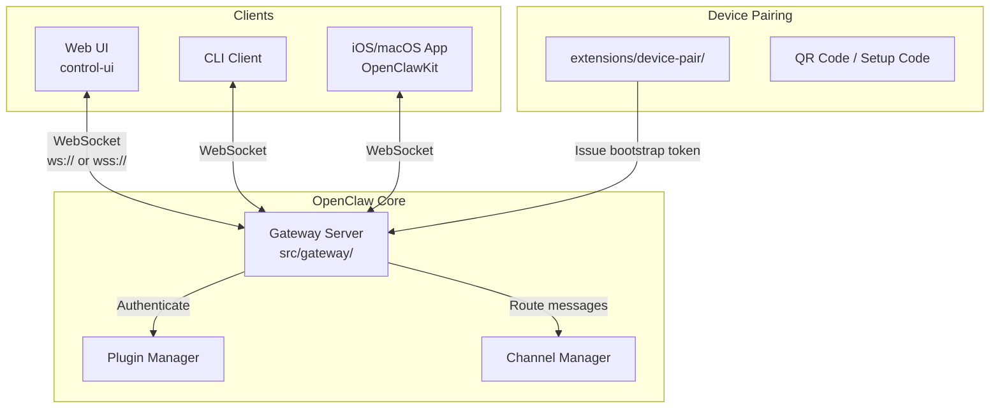

# 核心机制：Gateway（网关）

## 这是什么机制

**它是什么**：Gateway 是 OpenClaw 的 WebSocket 网关服务器，负责核心（Core）与各类客户端（UI、CLI、移动应用）之间的实时双向通信。

**为什么需要它**：没有 Gateway，系统将面临以下问题：
- 客户端无法实时接收 AI 助手的响应流
- 多设备场景下状态无法同步
- 命令执行结果无法及时推送到客户端
- 无法实现设备配对和权限管理

**设计核心**：采用 WebSocket 而非 HTTP 轮询，因为 AI 对话是长时间运行的流式过程，需要服务器主动推送事件；将网关独立出来，使核心逻辑与通信层解耦，支持多客户端并发连接。

---

## 架构概览



---

## 调用链

### 1. 设备配对流程

```
用户运行 /pair 命令
  → extensions/device-pair/index.ts:538 (registerCommand)
    → resolveGatewayUrl() 解析网关地址
    → issueDeviceBootstrapToken() 生成临时令牌
    → encodeSetupCode() 生成设置码/QR码
      → 用户扫描二维码或粘贴设置码到 iOS App
        → OpenClawKit 连接网关并发送 connect 请求
          → 网关验证 bootstrap token
            → 设备配对成功，发放 device token
```

### 2. 客户端连接流程

```
客户端启动
  → src/gateway/client.ts:189 (GatewayClient.start())
    → WebSocket 连接到网关
    → 等待 connect.challenge 事件 (获取 nonce)
    → sendConnect() 发送认证信息
      → selectConnectAuth() 选择认证方式
        → 优先使用 device token > shared token > bootstrap token > password
      → buildDeviceAuthPayloadV3() 构建签名负载
        → 使用设备私钥签名
    → 网关返回 HelloOk (连接成功)
      → 存储返回的 device token (DeviceAuthStore.storeToken)
```

### 3. 消息路由流程

```
客户端发送请求
  → GatewayChannelActor.request() (Swift)
    → 构建 RequestFrame { type: "req", id, method, params }
    → WebSocket 发送到网关
      → 网关路由到对应处理器
        → 返回 ResponseFrame { type: "res", id, ok, payload/error }
          → 客户端通过 pending[id] 找到等待的 continuation
            → 返回结果给调用者
```

---

## 关键实现

### WebSocket 协议设计

Gateway 使用自定义的 JSON 协议帧，定义在 `/Users/zhihu/code/m_code/ai/openclaw-my/src/gateway/protocol/`：

**三种帧类型**：
1. **RequestFrame** (`type: "req"`) - 客户端请求
2. **ResponseFrame** (`type: "res"`) - 服务器响应
3. **EventFrame** (`type: "event"`) - 服务器推送事件

```typescript
// 协议版本: 3
interface RequestFrame {
  type: "req";
  id: string;      // UUID
  method: string;  // 如 "connect", "sessions.send"
  params?: unknown;
}

interface ResponseFrame {
  type: "res";
  id: string;
  ok: boolean;
  payload?: unknown;
  error?: ErrorShape;
}

interface EventFrame {
  type: "event";
  event: string;   // 如 "tick", "chat.event"
  payload?: unknown;
  seq?: number;    // 序列号，用于检测消息丢失
}
```

### 设备身份认证

设备使用 Ed25519 密钥对进行身份认证：

```typescript
// src/gateway/device-auth.ts
function buildDeviceAuthPayloadV3(params: DeviceAuthPayloadV3Params): string {
  return [
    "v3",
    params.deviceId,
    params.clientId,
    params.clientMode,
    params.role,
    params.scopes.join(","),
    String(params.signedAtMs),
    params.token ?? "",
    params.nonce,
    params.platform,
    params.deviceFamily,
  ].join("|");
}
```

**认证流程**：
1. 设备生成密钥对（首次启动时）
2. 配对时交换公钥
3. 每次连接时，设备用私钥签名一个包含 nonce 的负载
4. 网关验证签名，确认设备身份

### 多层级认证策略

认证优先级（从高到低）：
1. **Device Token** - 已配对设备的长期令牌
2. **Shared Token** - 配置的共享令牌
3. **Bootstrap Token** - 临时配对令牌（一次性）
4. **Password** - 密码认证

代码见 `/Users/zhihu/code/m_code/ai/openclaw-my/src/gateway/client.ts:615`：
```typescript
selectConnectAuth(role: string): SelectedConnectAuth {
  const explicitToken = this.opts.token?.trim();
  const storedToken = loadDeviceAuthToken({ deviceId, role })?.token;

  // 优先使用显式令牌，否则使用存储的设备令牌
  const authToken = explicitToken ?? storedToken;
  // ...
}
```

### 移动客户端实现 (OpenClawKit)

位于 `/Users/zhihu/code/m_code/ai/openclaw-my/apps/shared/OpenClawKit/Sources/OpenClawKit/GatewayChannel.swift`：

**GatewayChannelActor** 是一个 Swift Actor，提供：
- 自动重连机制（指数退避）
- 心跳检测（tick watch）
- Keepalive ping（每15秒）
- 请求超时处理
- 设备令牌自动刷新

```swift
public actor GatewayChannelActor {
    private var task: WebSocketTaskBox?
    private var pending: [String: CheckedContinuation<GatewayFrame, Error>]
    private var backoffMs: Double = 500
    private var shouldReconnect = true

    // 连接流程
    public func connect() async throws {
        // 1. 创建 WebSocket 任务
        // 2. 等待 connect.challenge
        // 3. 发送带签名的 connect 请求
        // 4. 启动监听循环
    }
}
```

---

## 设备配对系统

### 配对流程

```
┌─────────────┐         ┌─────────────┐         ┌─────────────┐
│   用户      │         │  OpenClaw   │         │  iOS App    │
│  (聊天界面)  │         │   Core      │         │ (OpenClaw)  │
└──────┬──────┘         └──────┬──────┘         └──────┬──────┘
       │                       │                       │
       │  1. /pair            │                       │
       │────────────────────>│                       │
       │                       │  2. 生成 bootstrap    │
       │                       │     token + QR码      │
       │  3. 显示 QR码         │                       │
       │<────────────────────│                       │
       │                       │                       │
       │                       │<──────────────────────│ 4. 扫描二维码
       │                       │                       │
       │                       │  5. 发送配对请求       │
       │                       │<──────────────────────│    (含公钥)
       │                       │                       │
       │  6. 通知用户审批      │                       │
       │<────────────────────│                       │
       │                       │                       │
       │  7. /pair approve    │                       │
       │────────────────────>│                       │
       │                       │  8. 发放 device token │
       │                       │──────────────────────>│
       │                       │                       │
       │  9. 配对成功          │                       │
       │<────────────────────│                       │
```

### 安全模型

1. **Bootstrap Token**：一次性临时令牌，有效期短（通常几分钟）
2. **Device Token**：长期令牌，与设备ID和角色绑定
3. **签名验证**：所有连接请求都需用设备私钥签名
4. **TLS 支持**：生产环境必须使用 wss://（WebSocket Secure）

---

## 消息路由与多设备同步

### 网关事件类型

| 事件 | 描述 |
|------|------|
| `tick` | 心跳包，用于检测连接健康 |
| `connect.challenge` | 连接挑战，包含 nonce |
| `chat.event` | AI 对话事件（流式响应） |
| `agent.event` | Agent 执行事件 |
| `node.invoke.request` | 节点调用请求 |
| `device.pair.requested` | 设备配对请求通知 |
| `update.available` | 系统更新可用通知 |

### 多设备同步机制

1. **Presence（在线状态）**：网关维护所有连接客户端的 presence 列表
2. **StateVersion**：状态版本号，用于检测状态变更
3. **Snapshot**：连接时发送完整状态快照
4. **增量事件**：后续通过 EventFrame 发送增量更新

```typescript
// 状态版本跟踪
interface StateVersion {
  presence: number;
  health: number;
}

// 客户端检测消息丢失
if (this.lastSeq !== null && seq > this.lastSeq + 1) {
  this.opts.onGap?.({ expected: this.lastSeq + 1, received: seq });
}
```

---

## 设计决策

### 1. 为什么选择 WebSocket 而非 HTTP/2 或 gRPC？

- **流式响应**：AI 对话是长时间运行的过程，需要服务器主动推送
- **简单性**：JSON over WebSocket 易于调试和实现
- **兼容性**：WebSocket 在各种网络环境下兼容性更好
- **无依赖**：不需要额外的 gRPC 依赖

### 2. 为什么使用自定义协议而非 GraphQL 或 REST？

- **状态ful**：Gateway 是有状态的，需要维护客户端连接
- **实时性**：需要低延迟的双向通信
- **简单性**：自定义协议更轻量，没有 GraphQL 的复杂性

### 3. 设备认证的密钥管理策略

- **本地生成**：每个设备本地生成 Ed25519 密钥对
- **无中心 CA**：不需要中心化的证书颁发机构
- **配对时交换**：公钥在配对时通过 bootstrap token 保护的方式交换
- **私钥不离开设备**：私钥始终保存在设备本地 Keychain/安全存储中

### 4. 为什么使用 Actor 模型（Swift）？

- **线程安全**：Swift Actor 自动处理并发访问
- **状态隔离**：网关连接状态封装在 Actor 内部
- **异步友好**：与 Swift 的 async/await 模型完美集成

---

## 关键文件清单

| 文件 | 作用 |
|------|------|
| `/Users/zhihu/code/m_code/ai/openclaw-my/src/gateway/client.ts` | Node.js 网关客户端 |
| `/Users/zhihu/code/m_code/ai/openclaw-my/src/gateway/auth.ts` | 网关认证逻辑 |
| `/Users/zhihu/code/m_code/ai/openclaw-my/src/gateway/device-auth.ts` | 设备身份认证 |
| `/Users/zhihu/code/m_code/ai/openclaw-my/src/gateway/protocol/index.ts` | 协议定义 |
| `/Users/zhihu/code/m_code/ai/openclaw-my/src/infra/device-auth-store.ts` | 设备令牌存储 |
| `/Users/zhihu/code/m_code/ai/openclaw-my/extensions/device-pair/index.ts` | 设备配对插件 |
| `/Users/zhihu/code/m_code/ai/openclaw-my/apps/shared/OpenClawKit/Sources/OpenClawKit/GatewayChannel.swift` | Swift 网关通道 |
| `/Users/zhihu/code/m_code/ai/openclaw-my/apps/shared/OpenClawKit/Sources/OpenClawKit/DeviceAuthStore.swift` | Swift 设备认证存储 |
| `/Users/zhihu/code/m_code/ai/openclaw-my/apps/shared/OpenClawProtocol/GatewayModels.swift` | Swift 协议模型 |

---

## 总结

OpenClaw 的 Gateway 系统是一个精心设计的 WebSocket 网关，具有以下特点：

1. **安全性**：多层级认证（Device Token + 签名），强制 TLS
2. **可靠性**：自动重连、心跳检测、消息序列号防丢失
3. **可扩展性**：支持多种客户端类型（Web、CLI、iOS、Android）
4. **易用性**：QR 码配对简化设备接入流程
5. **解耦**：核心逻辑与通信层分离，便于独立演进
